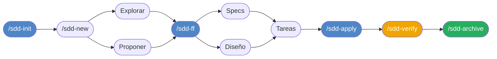
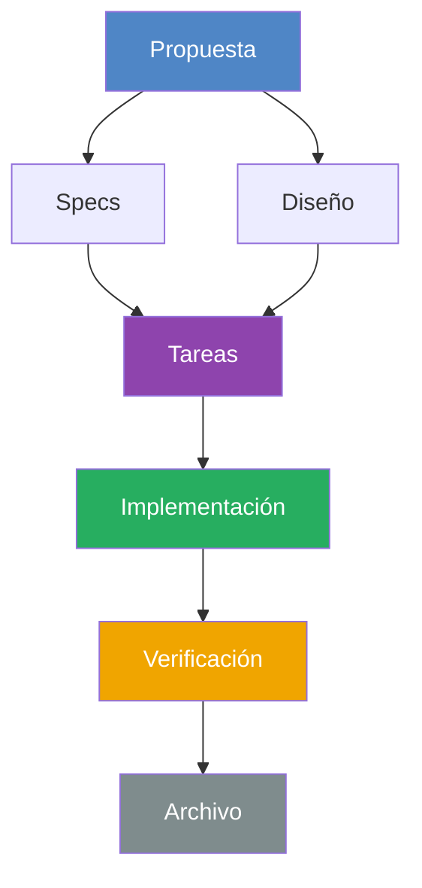

# Guías de Uso — Agent Teams Lite

> Guías paso a paso para usar Spec-Driven Development (SDD) con tus herramientas de AI.

---

## ¿Qué es Agent Teams Lite?

Es un patrón de orquestación donde un **agente coordinador liviano** delega todo el trabajo real a **sub-agentes especializados**. Cada sub-agente arranca con contexto fresco, ejecuta una tarea enfocada y devuelve un resultado estructurado.

El coordinador nunca escribe código, nunca lee el codebase directamente, nunca toma decisiones de arquitectura. Solo coordina, muestra resúmenes y te pide aprobación antes de continuar.

---

## Las Fases de SDD

| Comando | Qué hace |
|---------|----------|
| `/sdd-init` | Inicializa SDD en el proyecto, detecta el stack |
| `/sdd-explore <tema>` | Investiga una idea sin crear archivos |
| `/sdd-new <nombre>` | Inicia un cambio: exploración + propuesta |
| `/sdd-ff <nombre>` | Fast-forward: propuesta → specs → diseño → tareas |
| `/sdd-continue` | Crea el siguiente artefacto pendiente |
| `/sdd-apply` | Implementa las tareas en lotes |
| `/sdd-verify` | Valida la implementación contra las specs |
| `/sdd-archive` | Cierra el cambio y archiva los artefactos |
| `/sdd-commit` | CHANGELOG + commit convencional + engram sync |
| `/sdd-docs` | Genera AGENTS.md y CLAUDE.md del proyecto |
| `/sdd-v0 <componente>` | Genera componente frontend via v0 MCP _(extensión opcional)_ |

---

## Grafo de Dependencias entre Fases

> **Specs y Diseño se pueden crear en paralelo** — ambos dependen solo de la Propuesta.
> **Tareas depende de AMBOS** — no se puede iniciar sin specs y diseño completos.

---

## Claude Code vs OpenCode vs Antigravity: Diferencias Clave

```mermaid
graph TB
    subgraph ClaudeCode ["🤖 Claude Code — Sub-Agentes Reales"]
        CC1[Orquestador\nCLAUDE.md] -->|"Task tool"| CC2[Sub-agente\ncontexto fresco]
        CC2 -.->|"artefacto + Engram IDs"| CC1
    end

    subgraph OpenCode ["☁️ OpenCode — Sub-Agentes Reales"]
        OC1[Orquestador\nagent dedicado] -->|"Task tool"| OC2[Sub-agente\ncontexto fresco]
        OC2 -.->|"artefacto + Engram IDs"| OC1
    end

    subgraph Antigravity ["⚡ Antigravity — Ejecución Inline"]
        AG1[Orquestador] -->|"lee SKILL.md"| AG2[Ejecuta Explorador]
        AG2 -->|"mismo contexto"| AG3[Ejecuta Propuesta]
        AG3 -->|"mismo contexto"| AG4[Ejecuta Implementador]
    end
```

| Característica | Claude Code | OpenCode | Antigravity |
|---|---|---|---|
| Sub-agentes reales | ✅ Task tool | ✅ Task tool | ❌ Inline |
| Contexto aislado por fase | ✅ Sí | ✅ Sí | ❌ No |
| Activación del flujo | Triggers de texto | Slash commands `/sdd-*` | Triggers de texto |
| Orquestador vive en | `CLAUDE.md` (siempre activo) | Agent dedicado (se selecciona) | `GEMINI.md` (siempre activo) |
| Instalación | Skills + append CLAUDE.md | Skills + Comandos + Agente | Skills + Reglas globales |
| Riesgo de overflow | Muy bajo | Muy bajo | Moderado en features grandes |

---

## Persistencia de Artefactos

Los artefactos (propuestas, specs, diseños, tareas) se pueden guardar en:

| Modo | Descripción | Recomendado |
|------|-------------|-------------|
| `dual` | Engram + archivos en `openspec/` simultáneamente | ✅ Por defecto |
| `engram-only` | Solo Engram, sin archivos en el proyecto | Cuando el usuario lo pide explícitamente |

---

## Guías Específicas

- **[Guía Claude Code →](./claude-code.md)** — Instalación completa + flujo con sub-agentes vía Task tool + triggers de texto
- **[Guía OpenCode →](./opencode.md)** — Instalación completa + flujo con sub-agentes + slash commands nativos
- **[Guía Antigravity →](./antigravity.md)** — Instalación completa + flujo inline adaptado (sin sub-agentes)

---

## Extensiones Opcionales

Extensiones que se instalan con el framework pero requieren configuración adicional:

- **[v0 — Generación de componentes frontend →](../extensions/v0-setup.md)** — Genera componentes React/Vue/Svelte/Next.js usando v0 by Vercel vía MCP. Requiere cuenta en v0.dev y `V0_API_KEY`.
