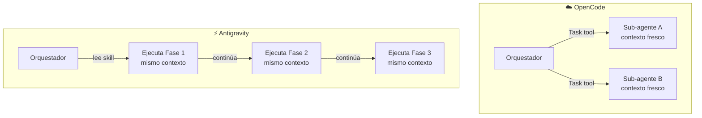
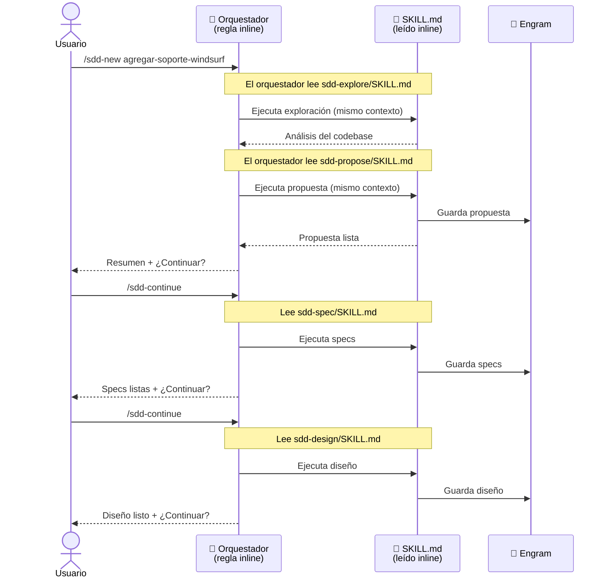
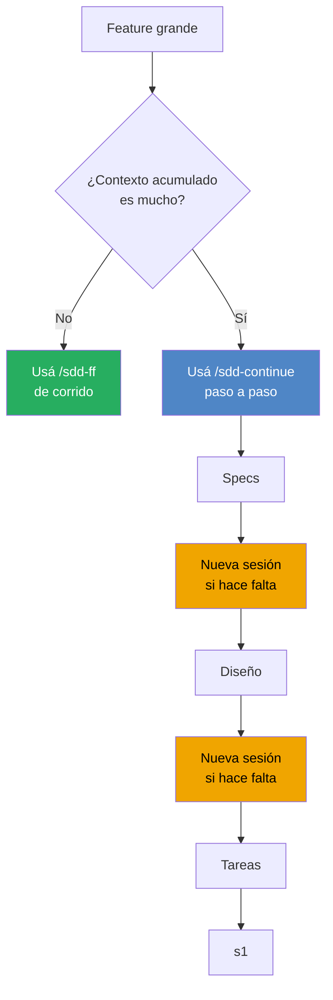

# Guía de Uso — Antigravity

> Guía completa desde cero: instalación, configuración y flujo de trabajo SDD en modo inline (sin sub-agentes).

---

## ¿Qué es Antigravity?

[Antigravity](https://github.com/vidalmaximiliano/antigravity) es el framework de agentes de Gemini CLI. A diferencia de OpenCode, **no dispara sub-agentes independientes** — el orquestador ejecuta cada skill inline, dentro del mismo contexto de conversación.

Esto significa que el flujo SDD funciona igual, pero el agente coordinador **leerá y ejecutará cada SKILL.md directamente**, en lugar de delegar a procesos separados.

---

## Diferencia clave vs OpenCode



| | OpenCode | Antigravity |
|---|---|---|
| Ejecución | Sub-agentes con contexto fresco | Inline, mismo contexto |
| Riesgo de overflow en features largas | Muy bajo | Moderado |
| Velocidad | Alta (paralelo posible) | Normal |
| Configuración | Skills + Comandos + Agente | Skills + Regla global |

> **Recomendación práctica**: en Antigravity, preferí `/sdd-new` + `/sdd-continue` (paso a paso) sobre `/sdd-ff` (todo de una) para features grandes. Así el contexto no se llena.

---

## ¿Qué necesitás?

- [Gemini CLI](https://github.com/google-gemini/gemini-cli) instalado y funcionando
- [Antigravity](https://github.com/vidalmaximiliano/antigravity) instalado
- [Engram](https://github.com/gentleman-programming/engram) instalado (recomendado)
- El repositorio `agent-teams-lite` clonado en tu máquina

---

## Paso 1 — Clonar el repositorio

```bash
git clone https://github.com/Gentleman-Programming/agent-teams-lite.git
cd agent-teams-lite
```

---

## Paso 2 — Instalar skills

```bash
bash scripts/install.sh
```

Elegí la opción **Antigravity** del menú:

```
Select your AI coding assistant:

  ...
  6) Antigravity    (~/.gemini/antigravity/skills/)
  ...

Choice [1-10]: 6
```

> **Modo no-interactivo:**
> ```bash
> bash scripts/install.sh --agent antigravity
> ```

El script instala las 12 skills en `~/.gemini/antigravity/skills/`.

---

## Paso 3 — Agregar la regla del orquestador

A diferencia de OpenCode (que usa un agente dedicado), Antigravity necesita que agregues el orquestador como **regla global** o **regla de workspace**.

### Opción A — Regla global (recomendado)

Agregá el contenido de `examples/antigravity/sdd-orchestrator.md` a tu archivo `~/.gemini/GEMINI.md`:

```bash
cat examples/antigravity/sdd-orchestrator.md >> ~/.gemini/GEMINI.md
```

Esto activa SDD en **todos tus proyectos**.

### Opción B — Regla de workspace (por proyecto)

Copiá el archivo al directorio `.agent/rules/` de tu proyecto:

```bash
mkdir -p .agent/rules
cp examples/antigravity/sdd-orchestrator.md .agent/rules/sdd-orchestrator.md
```

Esto activa SDD **solo en ese proyecto**.

---

## Paso 4 — Verificar la instalación

```bash
# Skills instaladas
ls ~/.gemini/antigravity/skills/sdd-*/SKILL.md

# Regla global (si usaste Opción A)
grep -l "sdd-init" ~/.gemini/GEMINI.md

# Regla de workspace (si usaste Opción B)
ls .agent/rules/sdd-orchestrator.md
```

---

## Paso 5 — (Opcional pero recomendado) Instalar Engram

```bash
# https://github.com/gentleman-programming/engram
```

Sin Engram, los artefactos no persisten entre sesiones. SDD funciona igual en modo `none`.

---

## Paso 6 — Abrir Gemini CLI con Antigravity en tu proyecto

```bash
cd /ruta/a/tu/proyecto
gemini  # Antigravity carga las reglas automáticamente
```

---

## Cómo funciona el flujo inline



> **¿Por qué paso a paso en vez de `/sdd-ff`?**
> En features largas, ejecutar todas las fases en una sola conversación puede saturar el contexto. Usar `/sdd-continue` te permite mantener el contexto manejable.

---

## Ejemplo Práctico: Agregar soporte para Windsurf

El mismo ejemplo que en la guía de OpenCode, adaptado al flujo de Antigravity.

---

### 6.1 — Inicializar SDD en el proyecto

```
/sdd-init
```

El orquestador lee `sdd-init/SKILL.md` inline y detecta el stack del repo.

**Resultado esperado:**
```
✓ Stack detectado: Shell scripts + Markdown
✓ Persistencia: engram
✓ SDD inicializado en agent-teams-lite
```

---

### 6.2 — Iniciar el cambio

```
/sdd-new agregar-soporte-windsurf
```

El orquestador ejecuta exploración y propuesta **en la misma conversación**:

**Resultado esperado:**
```
[Ejecutando sdd-explore...]
✓ install.sh: patrón claro para agregar agentes (get_tool_path + install_for_agent)
✓ examples/cursor/: estructura más similar a Windsurf, replicable

[Ejecutando sdd-propose...]
✓ Propuesta creada
  Intent: Agregar Windsurf como AI assistant soportado
  Scope: install.sh, install.ps1, examples/windsurf/, README.md
  Rollback: revertir los 4 archivos

¿Querés continuar con las specs?
```

---

### 6.3 — Specs (paso a paso)

```
/sdd-continue
```

```
[Ejecutando sdd-spec...]
✓ Specs creadas (3 requisitos, 6 escenarios)
  - El script debe detectar el path de Windsurf según OS
  - El agente sdd-orchestrator debe copiarse al directorio de Windsurf
  - README.md debe listar Windsurf en herramientas soportadas

¿Continuar con el diseño técnico?
```

---

### 6.4 — Diseño técnico

```
/sdd-continue
```

```
[Ejecutando sdd-design...]
✓ Diseño creado
  Patrón: replicar estructura de cursor/
  Path macOS/Linux: ~/.windsurf/skills/
  Path Windows: %USERPROFILE%/.windsurf/skills/
  Sin configuración especial adicional

¿Continuar con el desglose de tareas?
```

---

### 6.5 — Tareas

```
/sdd-continue
```

```
[Ejecutando sdd-tasks...]
✓ Tareas creadas (3 fases, 7 tareas)

  Fase 1 — Scripts
    1.1 Agregar windsurf a get_tool_path() en install.sh
    1.2 Agregar windsurf al menú interactivo en install.sh
    1.3 Replicar cambios en install.ps1

  Fase 2 — Ejemplos
    2.1 Crear examples/windsurf/windsurf-rules.md
    2.2 Crear examples/windsurf/README.md

  Fase 3 — Documentación
    3.1 Actualizar README.md — tabla "Supported Tools"
    3.2 Actualizar README.md — sección "Installation"

¿Listo para implementar?
```

> **Tip**: Este es un buen momento para hacer una pausa si la conversación ya es larga. Engram guardó todos los artefactos — podés abrir una nueva sesión y retomar con `/sdd-apply agregar-soporte-windsurf`.

---

### 6.6 — Implementar

```
/sdd-apply
```

El orquestador implementa fase por fase y te pide aprobación entre cada una:

```
[Ejecutando sdd-apply — Fase 1: Scripts]
✓ 1.1 Agregado windsurf a get_tool_path() en install.sh
✓ 1.2 Agregado windsurf al menú en install.sh
✓ 1.3 Replicado en install.ps1

3/7 tareas completas. ¿Continuar con Fase 2?
```

```
[Fase 2: Ejemplos]
✓ 2.1 Creado examples/windsurf/windsurf-rules.md
✓ 2.2 Creado examples/windsurf/README.md

5/7 tareas completas. ¿Continuar con Fase 3?
```

```
[Fase 3: Documentación]
✓ 3.1 Actualizado README.md — Supported Tools
✓ 3.2 Actualizado README.md — Installation

7/7 tareas completas ✅
```

---

### 6.7 — Verificar

```
/sdd-verify
```

```
[Ejecutando sdd-verify...]
✅ PASS — install.sh detecta path de Windsurf según OS
✅ PASS — install.ps1 detecta path de Windsurf según OS
✅ PASS — examples/windsurf/ existe con archivos de configuración
✅ PASS — README.md lista Windsurf en herramientas soportadas
⚠️  WARNING — install_test.sh no tiene tests para el nuevo agente

4/4 specs cumplidas, 1 warning menor
```

---

### 6.8 — Archivar

```
/sdd-archive
```

```
✓ Cambio archivado: agregar-soporte-windsurf
✓ 7 tareas completadas
✓ Artefactos guardados en engram
```

---

## Referencia Rápida

```bash
/sdd-init                          # Inicializar SDD en el proyecto
/sdd-explore <tema>                # Investigar sin crear artefactos
/sdd-new <nombre>                  # Iniciar cambio (exploración + propuesta)
/sdd-continue                      # Siguiente fase pendiente (recomendado en Antigravity)
/sdd-ff <nombre>                   # Todas las fases de golpe (solo features pequeñas)
/sdd-apply                         # Implementar por fases
/sdd-verify                        # Validar contra specs
/sdd-archive                       # Cerrar el cambio
```

---

## Estrategia para Features Grandes



> **Regla práctica**: si una fase tarda más de 5 minutos, considerá iniciar una nueva sesión. Engram habrá guardado los artefactos y el orquestador los recuperará automáticamente.

---

## Troubleshooting

### El orquestador no entiende los comandos `/sdd-*`
La regla del orquestador no está cargada. Verificá:
```bash
# Regla global
grep "sdd-init" ~/.gemini/GEMINI.md

# Regla de workspace
cat .agent/rules/sdd-orchestrator.md | head -5
```
Si no existe, seguí el **Paso 3** de esta guía.

### "Skill file not found" durante la ejecución
El SKILL.md no está instalado. Verificá:
```bash
ls ~/.gemini/antigravity/skills/sdd-*/SKILL.md
```
Deberían aparecer 12 skills. Si no, re-ejecutá `bash scripts/install.sh --agent antigravity`.

### El orquestador intenta ejecutar todo a la vez y el contexto explota
Es el comportamiento de `/sdd-ff` con features largas. Usá `/sdd-new` primero y luego `/sdd-continue` para cada fase por separado.

### Los artefactos desaparecen al cerrar la sesión
Engram no está instalado o no está activo. Instalalo desde [aquí](https://github.com/gentleman-programming/engram) o trabajá siempre en la misma sesión usando `/sdd-continue`.
