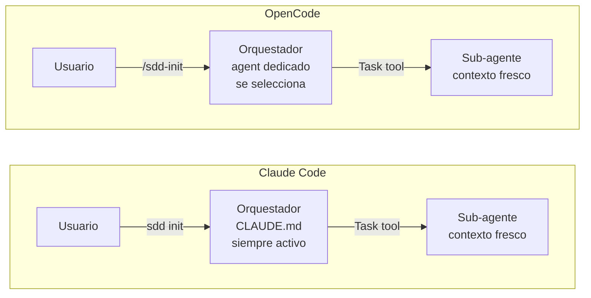
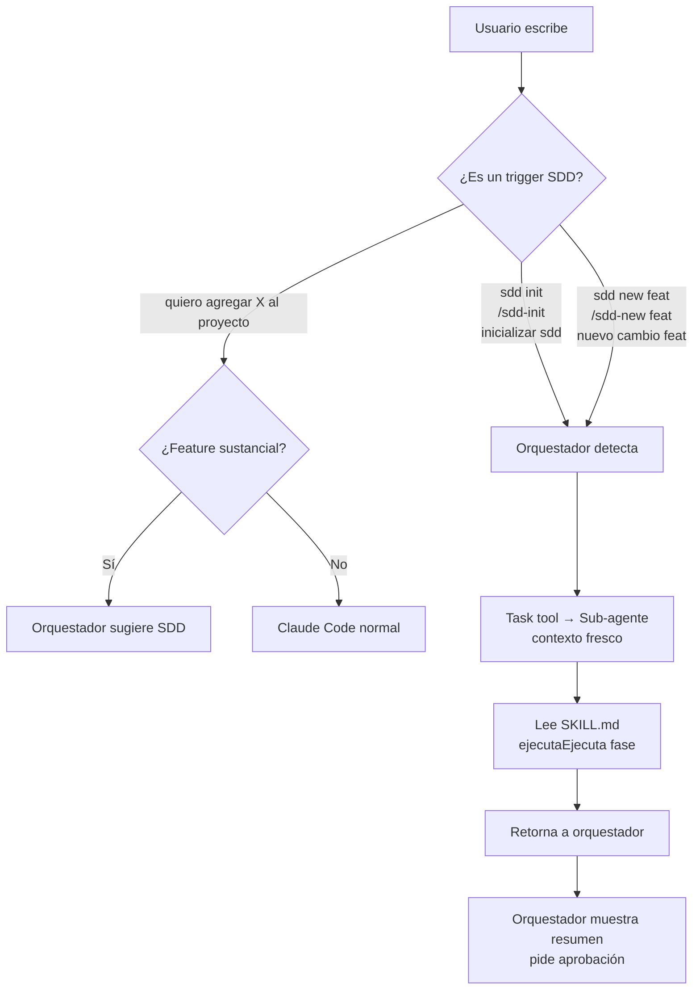
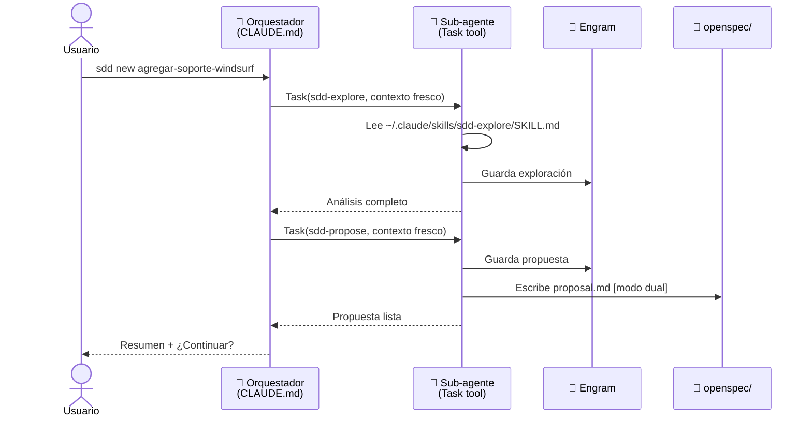

# Guía de Uso — Claude Code

> Guía completa desde cero: instalación, configuración y flujo de trabajo SDD con sub-agentes reales vía Task tool.

---

## ¿Qué hace Claude Code diferente?

Claude Code es, junto con OpenCode, el target de **primera clase** de este framework. Ambos soportan sub-agentes reales con contexto fresco mediante el `Task tool`.

La diferencia clave con OpenCode es de **configuración, no de capacidad**:



| Aspecto | Claude Code | OpenCode |
|---|---|---|
| Orquestador | Vive en `~/.claude/CLAUDE.md` — siempre activo | Agente dedicado en `~/.config/opencode/agents/` — se selecciona |
| Activación | Triggers de texto detectados automáticamente | Slash commands explícitos (`/sdd-*`) |
| Sub-agentes | ✅ Task tool — contexto fresco | ✅ Task tool — contexto fresco |
| Capacidad SDD | Equivalente a OpenCode | Equivalente a Claude Code |

---

## ¿Qué necesitás?

- [Claude Code](https://claude.ai/code) instalado y funcionando
- [Engram](https://github.com/gentleman-programming/engram) instalado — **obligatorio**
- El repositorio `agent-teams-lite` clonado en tu máquina

---

## Paso 1 — Instalar Engram

Engram es el backend de persistencia. Sin él, Claude Code no puede iniciar el flujo SDD.

```bash
# Seguí las instrucciones en:
# https://github.com/gentleman-programming/engram
```

Verificá que está activo antes de continuar:

```bash
engram --version
```

---

## Paso 2 — Clonar el repositorio

```bash
git clone https://github.com/Gentleman-Programming/agent-teams-lite.git
cd agent-teams-lite
```

---

## Paso 3 — Instalar skills

```bash
bash scripts/install.sh
```

Elegí la opción **Claude Code**:

```
Select your AI coding assistant:

  1) Claude Code    (~/.claude/skills)
  ...

Choice [1-10]: 1
```

> **Modo no-interactivo:**
> ```bash
> bash scripts/install.sh --agent claude-code
> ```

El script instala las 12 skills en `~/.claude/skills/`.

**Verificar:**

```bash
ls ~/.claude/skills/sdd-*/SKILL.md
# Deben aparecer 12 archivos
```

---

## Paso 4 — Agregar el orquestador a CLAUDE.md

Claude Code carga instrucciones del sistema desde `~/.claude/CLAUDE.md`. El orquestador SDD se agrega como una sección de ese archivo — no reemplaza tu configuración existente.

```bash
cat examples/claude-code/CLAUDE.md >> ~/.claude/CLAUDE.md
```

O si preferís control manual: abrí `~/.claude/CLAUDE.md` y pegá el contenido de `examples/claude-code/CLAUDE.md` al final.

---

## Paso 5 — Verificar la instalación

Abrí Claude Code en cualquier proyecto:

```bash
cd /ruta/a/tu/proyecto
claude
```

Escribí:

```
sdd init
```

Claude debería reconocer el trigger, verificar que Engram está disponible, e inicializar SDD en el proyecto.

---

## Cómo funcionan los triggers en Claude Code

A diferencia de OpenCode (que tiene slash commands nativos `/sdd-*`), Claude Code detecta el intent SDD desde texto natural:



**Triggers reconocidos:**

| Lo que escribís | Lo que activa |
|---|---|
| `sdd init` / `/sdd-init` | Inicialización de SDD |
| `sdd new <nombre>` / `/sdd-new <nombre>` | Nuevo cambio |
| `sdd ff <nombre>` / `/sdd-ff <nombre>` | Fast-forward de planificación |
| `sdd apply` / `/sdd-apply` | Implementación |
| `sdd verify` / `/sdd-verify` | Verificación |
| `sdd archive` / `/sdd-archive` | Archivo del cambio |
| Describir un feature sustancial | Sugerencia automática de SDD |

---

## Cómo funciona el Task tool con sub-agentes



Cada sub-agente:
- Arranca con **contexto completamente fresco** — no acumula el historial de conversación
- Lee su skill file desde `~/.claude/skills/sdd-{fase}/SKILL.md`
- Escribe a Engram (siempre) y a `openspec/` (en modo `dual`)
- Retorna un envelope estructurado al orquestador

---

## Ejemplo Práctico: Agregar soporte para Windsurf

El mismo ejemplo que en las guías de OpenCode y Antigravity.

---

### 5.1 — Inicializar SDD

```
sdd init
```

```
✓ Engram disponible — OK
✓ Stack detectado: Shell scripts + Markdown
✓ Modo: dual (Engram + openspec/)
✓ .gitignore configurado
  - .engram/engram.db → excluido
  - .engram/chunks/   → versionado (team sync)
✓ openspec/ inicializado
✓ Contexto guardado en Engram — sdd-init/agent-teams-lite

Listo para /sdd-new o sdd explore
```

---

### 5.2 — Iniciar el cambio

```
sdd new agregar-soporte-windsurf
```

El orquestador lanza dos sub-agentes en secuencia via Task tool:

```
[Sub-agente: sdd-explore — contexto fresco]
✓ install.sh: patrón claro para agregar agentes (get_tool_path + install_for_agent)
✓ examples/cursor/: estructura más similar a Windsurf

[Sub-agente: sdd-propose — contexto fresco]
✓ Propuesta guardada en Engram — sdd/agregar-soporte-windsurf/proposal
✓ proposal.md escrito en openspec/changes/agregar-soporte-windsurf/

Intent: Agregar Windsurf como AI assistant soportado
Scope: install.sh, install.ps1, examples/windsurf/, README.md
Rollback: revertir 4 archivos

¿Continuar con specs y diseño?
```

---

### 5.3 — Fast-forward de planificación

```
sdd ff agregar-soporte-windsurf
```

Lanza 4 sub-agentes en secuencia. Muestra resumen solo al final:

```
[Sub-agente: sdd-spec]   ✓ 3 requisitos, 6 escenarios
[Sub-agente: sdd-design] ✓ Path macOS: ~/.windsurf/skills/
[Sub-agente: sdd-tasks]  ✓ 3 fases, 7 tareas

─────────────────────────────────────────────
Planificación completa para: agregar-soporte-windsurf

Specs:  sdd/agregar-soporte-windsurf/spec    (Engram #1234)
Design: sdd/agregar-soporte-windsurf/design  (Engram #1235)
Tasks:  sdd/agregar-soporte-windsurf/tasks   (Engram #1236)

Fase 1 — Scripts (3 tareas)
Fase 2 — Ejemplos (2 tareas)
Fase 3 — Documentación (2 tareas)

¿Listo para implementar?
```

---

### 5.4 — Implementar

```
sdd apply
```

```
[Sub-agente: sdd-apply — Fase 1, Tasks 1.1-1.3]
✓ 1.1 get_tool_path() actualizado en install.sh
✓ 1.2 Menú interactivo actualizado en install.sh
✓ 1.3 Replicado en install.ps1

3/7 tareas completas. ¿Continuar con Fase 2?
```

---

### 5.5 — Verificar

```
sdd verify
```

```
[Sub-agente: sdd-verify]
✅ PASS — install.sh detecta path de Windsurf según OS
✅ PASS — install.ps1 detecta path de Windsurf según OS
✅ PASS — examples/windsurf/ existe con archivos de configuración
✅ PASS — README.md lista Windsurf en herramientas soportadas
⚠️  WARNING — install_test.sh no cubre el nuevo agente

4/4 specs cumplidas, 1 warning menor
```

---

### 5.6 — Commit con sync de Engram

```
sdd commit
```

El agente `sdd-commit` ejecuta el flujo completo:

```
[Recuperando contexto desde Engram...]
✓ Propuesta leída — Type: feat, Scope: installer

[Actualizando CHANGELOG.md...]
✓ Entrada agregada en "Completed (ready for next release)"

[Ejecutando engram sync --project agent-teams-lite...]
✓ .engram/chunks/chunk-0042.jsonl.gz generado

[Commit preview]
feat(installer): add Windsurf as supported AI assistant

Spec: sdd/agregar-soporte-windsurf/
Tasks: 7/7 completed

Implemented:
- Windsurf path detection in install.sh / install.ps1
- examples/windsurf/ with configuration files
- README.md updated

📦 Archivos a commitear:
- CHANGELOG.md
- scripts/install.sh
- scripts/install.ps1
- examples/windsurf/windsurf-rules.md
- .engram/chunks/chunk-0042.jsonl.gz  ← memoria del equipo

¿Proceder? (yes/no/edit)
```

---

### 5.7 — Archivar

```
sdd archive
```

```
✓ Cambio archivado: agregar-soporte-windsurf
✓ 7 tareas completadas
✓ openspec/changes/agregar-soporte-windsurf/ → openspec/changes/archive/2026-03-05-agregar-soporte-windsurf/
✓ Archive report guardado en Engram — sdd/agregar-soporte-windsurf/archive-report
```

---

## Referencia Rápida de Triggers

```
sdd init                           # Inicializar SDD
sdd explore <tema>                 # Investigar sin crear artefactos
sdd new <nombre-del-cambio>        # Iniciar cambio
sdd ff <nombre-del-cambio>         # Fast-forward: specs + diseño + tareas
sdd continue                       # Siguiente fase pendiente
sdd apply                          # Implementar por fases
sdd verify                         # Validar contra specs
sdd commit                         # CHANGELOG + commit + engram sync
sdd archive                        # Cerrar el cambio
```

> También funciona con `/sdd-init`, `/sdd-new`, etc. — ambos formatos son reconocidos.

---

## Onboarding de un nuevo developer

Cuando un compañero de equipo se suma al proyecto:

```bash
git clone <repo>
cd <proyecto>

# Importar la memoria del equipo desde los chunks en git
engram sync --import --project <nombre-proyecto>

# Abrir Claude Code — ya tiene todo el contexto
claude
```

---

## Troubleshooting

### "Engram is required but not available"
Engram no está instalado o el servidor MCP no está activo. Instalalo desde [https://github.com/gentleman-programming/engram](https://github.com/gentleman-programming/engram) y verificá que el MCP está configurado en Claude Code.

### Claude Code no detecta los triggers SDD
El orquestador no está cargado. Verificá que el contenido de `examples/claude-code/CLAUDE.md` está al final de `~/.claude/CLAUDE.md`:
```bash
grep "SDD Orchestrator" ~/.claude/CLAUDE.md
```

### "Skill file not found" en un sub-agente
Los skills no están instalados. Verificá:
```bash
ls ~/.claude/skills/sdd-*/SKILL.md
```
Si faltan, re-ejecutá `bash scripts/install.sh --agent claude-code`.

### El sub-agente ejecuta inline en vez de con contexto fresco
El orquestador en CLAUDE.md está usando el `Skill tool` en vez del `Task tool`. Verificá que el contenido de `examples/claude-code/CLAUDE.md` está completo y no truncado — las instrucciones del Task tool deben estar presentes.

### Los chunks `.engram/chunks/` no aparecen en el commit
`sdd commit` no ejecutó `engram sync`. Podés hacerlo manualmente:
```bash
engram sync --project <nombre-proyecto>
git add .engram/chunks/
```
