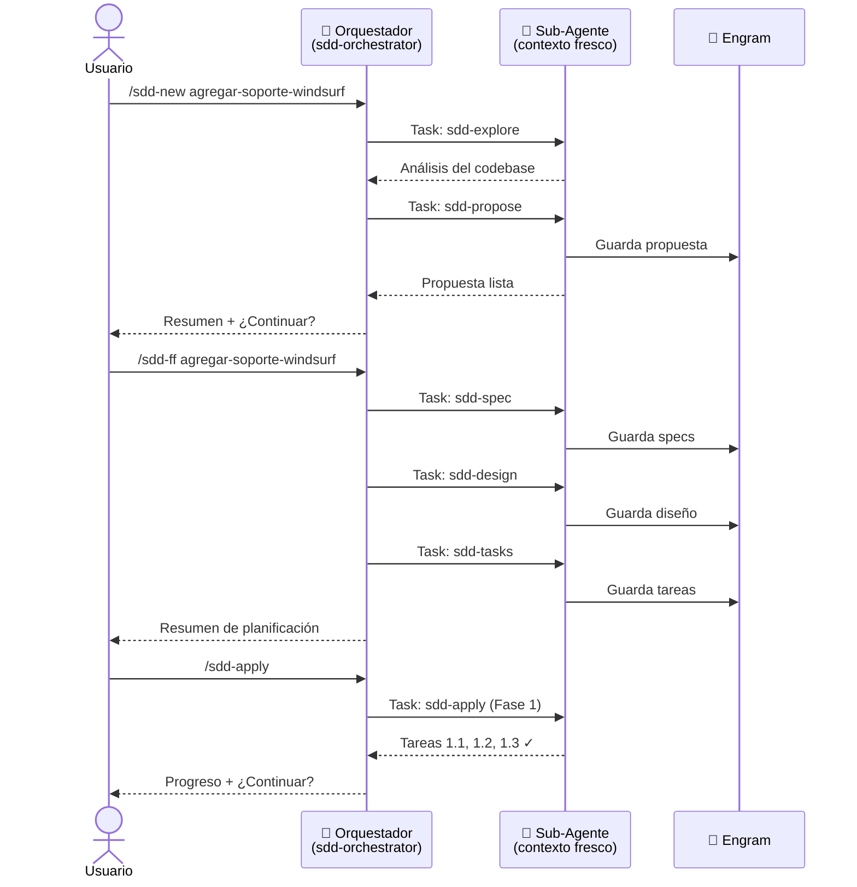

# Guía de Uso — OpenCode

> Guía completa desde cero: instalación, configuración y flujo de trabajo SDD con sub-agentes reales.

---

## ¿Qué necesitás?

- [OpenCode](https://opencode.ai) instalado y funcionando
- [Engram](https://github.com/gentleman-programming/engram) instalado (recomendado para persistencia)
- El repositorio `agent-teams-lite` clonado en tu máquina

---

## Paso 1 — Clonar el repositorio

```bash
git clone https://github.com/Gentleman-Programming/agent-teams-lite.git
cd agent-teams-lite
```

---

## Paso 2 — Instalar skills, comandos y agente

Ejecutá el script de instalación y elegí la opción **OpenCode**:

```bash
bash scripts/install.sh
```

Verás un menú interactivo:

```
Select your AI coding assistant:

  1) Claude Code    (~/.claude/skills)
  2) OpenCode       (~/.config/opencode/skills)
  ...

Choice [1-10]: 2
```

Elegí `2`. El script instalará automáticamente:

| Qué instala | Dónde |
|-------------|-------|
| 12 skills SDD | `~/.config/opencode/skills/` |
| 8 comandos `/sdd-*` | `~/.config/opencode/commands/` |
| Agente `sdd-orchestrator` | `~/.config/opencode/agents/` |

> **Modo no-interactivo** (útil para scripts o CI):
> ```bash
> bash scripts/install.sh --agent opencode
> ```

---

## Paso 3 — Verificar la instalación

Confirmá que los archivos existen:

```bash
# Skills
ls ~/.config/opencode/skills/sdd-*/SKILL.md

# Comandos
ls ~/.config/opencode/commands/sdd-*.md

# Agente
cat ~/.config/opencode/agents/sdd-orchestrator.md | head -5
```

Deberías ver 12 skills, 11 comandos, y el agente listado.

---

## Paso 4 — (Opcional pero recomendado) Instalar Engram

Engram provee memoria persistente entre sesiones. Sin él, los artefactos SDD no sobreviven al cierre del chat.

```bash
# Seguí las instrucciones en:
# https://github.com/gentleman-programming/engram
```

Si no tenés Engram, SDD funciona igual pero en modo `none` — los artefactos viven solo en la sesión actual.

---

## Paso 5 — Abrir OpenCode en tu proyecto

```bash
cd /ruta/a/tu/proyecto
opencode
```

---

## Cómo funciona el flujo con Sub-Agentes



**La clave**: cada sub-agente arranca con contexto limpio. Eso evita que el historial de conversación se llene y empiece a alucinar con features largas.

---

## Ejemplo Práctico: Agregar soporte para Windsurf

Vamos a usar SDD para contribuir al propio repo `agent-teams-lite` y agregar soporte para **Windsurf** como nuevo AI assistant compatible.

### ¿Qué implica?
- Agregar path de instalación en `scripts/install.sh` e `install.ps1`
- Crear `examples/windsurf/` con el archivo de configuración del orquestador
- Actualizar `README.md` con la nueva opción

---

### 5.1 — Inicializar SDD en el proyecto

```
/sdd-init
```

El orquestador detecta el stack del repo (bash + PowerShell + Markdown) y bootstrapea el backend de persistencia.

**Resultado esperado:**
```
✓ Stack detectado: Shell scripts + Markdown
✓ Persistencia: engram
✓ SDD inicializado en agent-teams-lite
```

---

### 5.2 — Iniciar el cambio

```
/sdd-new agregar-soporte-windsurf
```

El orquestador lanza dos sub-agentes en secuencia:

1. **Explorer** — lee el repo, entiende la estructura de `install.sh`, los ejemplos existentes (opencode, cursor, etc.)
2. **Proposer** — genera la propuesta con intent, scope y plan de rollback

**Resultado esperado:**
```
✓ Exploración completa
  - install.sh: patrón existente para agregar agentes (get_tool_path + install_for_agent)
  - examples/: estructura replicable desde cursor/ o antigravity/
  - README.md: sección "Supported Tools" a actualizar

✓ Propuesta creada
  Intent: Agregar Windsurf como AI assistant soportado
  Scope: install.sh, install.ps1, examples/windsurf/, README.md
  Rollback: revertir los 4 archivos modificados

¿Querés continuar con specs y diseño?
```

---

### 5.3 — Fast-forward de planificación

```
/sdd-ff agregar-soporte-windsurf
```

Lanza specs, diseño y tareas en secuencia. Al final muestra un resumen de todo:

**Resultado esperado:**
```
✓ Specs (3 requisitos, 6 escenarios)
  - El script de instalación debe detectar el path de Windsurf según OS
  - El agente sdd-orchestrator debe copiarse al directorio de Windsurf
  - README.md debe documentar Windsurf en la tabla de herramientas soportadas

✓ Diseño
  - Patrón: replicar la estructura de cursor/ (más similar a Windsurf)
  - Path macOS/Linux: ~/.windsurf/skills/
  - Path Windows: %USERPROFILE%/.windsurf/skills/

✓ Tareas (3 fases, 7 tareas)
  Fase 1 — Scripts (3 tareas)
  Fase 2 — Ejemplos (2 tareas)
  Fase 3 — Documentación (2 tareas)

¿Listo para implementar?
```

---

### 5.4 — Implementar

```
/sdd-apply
```

El orquestador implementa por lotes (una fase a la vez):

**Fase 1 — Scripts:**
```
✓ 1.1 Agregado windsurf a get_tool_path() en install.sh
✓ 1.2 Agregado windsurf al menú interactivo en install.sh
✓ 1.3 Replicado el mismo cambio en install.ps1

3/7 tareas completas. ¿Continuar con Fase 2?
```

**Fase 2 — Ejemplos:**
```
✓ 2.1 Creado examples/windsurf/windsurf-rules.md
✓ 2.2 Creado examples/windsurf/README.md

5/7 tareas completas. ¿Continuar con Fase 3?
```

**Fase 3 — Documentación:**
```
✓ 3.1 Actualizado README.md — tabla "Supported Tools"
✓ 3.2 Actualizado README.md — sección "Installation"

7/7 tareas completas ✅
```

---

### 5.5 — Verificar

```
/sdd-verify
```

El sub-agente compara la implementación contra las specs:

**Resultado esperado:**
```
✅ PASS — install.sh detecta path de Windsurf según OS
✅ PASS — install.ps1 detecta path de Windsurf según OS
✅ PASS — examples/windsurf/ existe con archivos de configuración
✅ PASS — README.md lista Windsurf en herramientas soportadas
⚠️  WARNING — install_test.sh no tiene tests para el nuevo agente

Verificación: 4/4 specs cumplidas, 1 warning menor
```

---

### 5.6 — Archivar

```
/sdd-archive
```

Cierra el cambio y persiste el estado final en Engram.

```
✓ Cambio archivado: agregar-soporte-windsurf
✓ 7 tareas completadas
✓ Artefactos guardados en engram
```

---

## Referencia Rápida de Comandos

```bash
/sdd-init                          # Inicializar SDD en el proyecto actual
/sdd-explore <tema>                # Investigar una idea (sin crear archivos)
/sdd-new <nombre-del-cambio>       # Iniciar cambio: exploración + propuesta
/sdd-ff <nombre-del-cambio>        # Fast-forward: specs + diseño + tareas
/sdd-continue                      # Crear el siguiente artefacto pendiente
/sdd-apply                         # Implementar (por fases, con aprobación)
/sdd-verify                        # Validar implementación contra specs
/sdd-archive                       # Cerrar y archivar el cambio
```

---

## Troubleshooting

### "sdd-orchestrator agent not found"
El agente no está instalado o OpenCode no lo carga. Verificá:
```bash
ls ~/.config/opencode/agents/sdd-orchestrator.md
```
Si no existe, re-ejecutá `bash scripts/install.sh --agent opencode`.

### Los comandos `/sdd-*` no aparecen en el autocomplete
OpenCode carga comandos desde `~/.config/opencode/commands/`. Verificá:
```bash
ls ~/.config/opencode/commands/sdd-*.md
```

### "Skill file not found" durante la ejecución
Un sub-agente no encuentra el SKILL.md. Verificá:
```bash
ls ~/.config/opencode/skills/sdd-*/SKILL.md
```

### Los artefactos no persisten entre sesiones
Engram no está disponible. O bien instalalo siguiendo [las instrucciones](https://github.com/gentleman-programming/engram), o usá `openspec` (el orquestador te lo preguntará).
